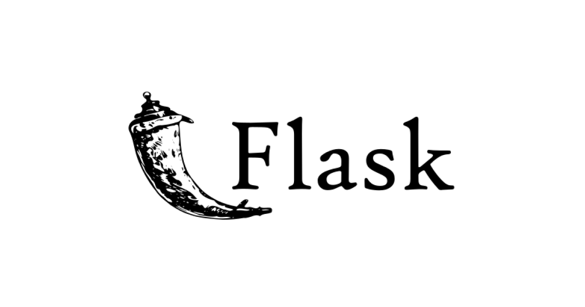

## Deploy a Flask App in Vercel with statics files

Hi forks in this repo you will find out how to deploy a Flask App with static files on Vercel, it's simple.

## Structure 📂

First you need to know the structure of Flask App, and which looks like this:

> [!NOTE]
> In this structure, all files Jinja2 needs to run is in the app folder. If you want to put static folder and app.py in root you can do it.

```
vercel_deploy
├── app
    ├── static
    │   ├── images
    │   ├── js
    │   └── css
    ├── templates
    ├── app.py
├── .gitignore
├── LICENSE
├── README.md
├── requirements.txt
└── vercel.json
```

* static contain static files like images, CSS, and JavaScript files.
* templates contain the file that will be rendered for display in the browser.
* app.py is the main file of this app.
* .gitignore is a file to exclude some folders like venv.
* LICENSE is a file that contains the license used in this app.
* README.md is the file you are reading now.
* requirements.txt is a file that contains a list of dependencies used in this app.
* vercel.json is a file that contains configuration and override the default behavior of Vercel.

## Explication

For the correct functioning of static files, you need to specify the direction of you static folder in 'routes' and 'builds'. In this case our project is in app folder so we need to direct to it:

```javascript
// builds
{
"src": "app/static/**/*",
"use": "@vercel/static"
}

// routes
{
"src": "/app/static/(.*)",
"dest": "/app/static/$1"
}
```

And just include the CSS style in HTML as a relative path like this:

```html

```

> [!WARNING]
> If you have static folder in the root directory, you can use the following path ``{{ url_for('static', filename='css/style.css') }}`` which uses a default static path. Jinja2 searches fot the static folder in the root directory, and if you place this folder inside other one, it will not find it.

## Installation 🛠️

* Clone the repository:

  ```
  git clone https://github.com/azzchan/flask-vercel.git
  ```
* Create a virtual environment:

  ```
  python -m venv venv
  ```
* Activate virtual environment:

  ```
  venv/Scripts/activate
  ```
* Install dependencies:

  ```
  pip install -r requirements.txt
  ```
* You can run this as a Flask app use

  ```
  python app.py
  ```

> [!IMPORTANT]
> It is mandatory to install Node.js and npm in order to use Vercel CLI. For more details consider visiting the offical website: [Vercel CLI](https://vercel.com/docs/cli).

* Also you can use a Vercel CLI in a development environment using:
  ```
  vercel dev
  ```
* If you need to deploy in Vercel via Vercel CLI, use:
  ```
  vercel --prod
  ```
